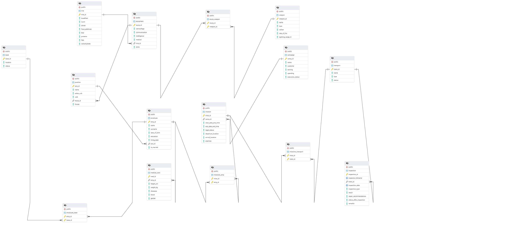
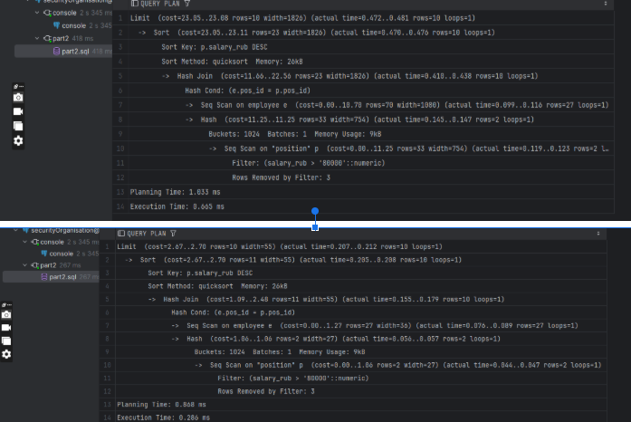

# Система управления миссиями и персоналом частной охранной организации

## 1. Описание предметной области

### Описание

Частная охранная организация имеет штаб **СОТРУДНИКОВ**, которые могут занимать различные **должности**. 
Каждый сотрудник имеет **МЕДКАРТУ** и закрепленную за ним **БАЗУ**, являющуюся его основным местом пребывания. 
Сотрудники могут быть направлены на **ЗАДАЧИ**. 
Задача является важной частью охранной **КАМПАНИИ** на **ТРАНСПОРТЕ**, принадлежащем охранной организации.

Для безопасности стоит хранить историю всех **ТЕХОСМОТРОВ**. 
Сотрудникам должны предоставляться комплекты **ЭКИПИРОВКИ**.
Экипировка в обязательном порядке должна включать один из ИРП и может содержать одно или несколько **ОРУЖИЙ**.

### Правила

**_СОТРУДНИКИ_** : работникИ, необходимо узнать ИМЯ, ФАМИЛИЮ, ДАТУ_РОЖДЕНИЯ, ОБРАЗОВАНИЕ и текущий СЕМЕЙНЫЙ_СТАТУС, а также хранить его ДАТУ_ЗАЧИСЛЕНИЯ на службу.

**_ДОЛЖНОСТИ_** : НАЗВАНИЕ_ДОЛЖНОСТИ, ЗАРПЛАТУ ВОИНСКОЕ_ЗВАНИЕ если есть, номер комплекта ЭКИПИРОВКИ, и тип ВООРУЖЕННЫХ_СИЛ (также работники могут занимать гражданские должности).

**_МЕДКАРТА_** : с информацией о РОСТЕ в см, ВЕСЕ в кг, ГРУППЕ_КРОВИ (по системе AB0), ПЕРЕНЕСЁННЫХ_ТРАВМАХ/ЗАБОЛЕВАНИЯХ, БИОЛОГИЧЕСКОМ_ПОЛЕ

**_БАЗА_** : с информацией о МЕСТОПОЛОЖЕНИИ базы и её СТАТУСЕ

**_МИССИИ_** : нужно хранить НАЗВАНИЕ, ДАТУ_И_ВРЕМЯ_СТАРТА и ЗАВЕРШЕНИЯ, ЮРИДИЧЕСКИЙ_СТАТУС, МЕСТО_ОТПРАВЛЕНИЯ и ПРИБЫТИЯ, ВРАГОВ, а также историю миссий сотрудников

**_ОРГАНИЗАЦИЯ_** : должно содержать НАЗВАНИЕ, ЗАКАЗЧИКА, ПРИБЫЛЬ, ЗАТРАТЫ и СТАТУС_ВЫПОЛЕНИЯ

_**ТРАНСПОРТ**_ : НАЗВАНИЕ, ТИП, СОСТОЯНИЕ 

**_ЭКИПИРОВКИ_** : может быть (но необязательно) КАМУФЛЯЖ, СРЕДСТВА_КОММУНИКАЦИИ, РАЗВЕДКИ, МЕДИКАМЕНТЫ и ПРОЧЕЕ.
В обязательном порядке должна включать один из ИРП (с описанием о БЕЛКАХ, ЖИРАХ, УГЛЕВОДАХ и КАЛОРИЙНОСТИ, блюдах ЗАВТРАКА, ОБЕДА, УЖИНА, ПИЩЕВЫХ_ДОБАВКАХ).

**_ОРУЖИЯ_** : с техническими характеристиками, будь то НАЗВАНИЕ, ТИП, КАЛИБР, СКОРОСТРЕЛЬНОСТЬ, ДЛИНА_СТВОЛА, ПРИЦЕЛЬНАЯ_ДАЛЬНОСТЬ

### Бизнес-процессы

Лица, не имеющие необходимых квалификаций, не могут быть отправлены на охранные задачи. 
Информационная система должна учитывать, какие сотрудники находятся на задачах (один и тот же сотрудник не может находиться на двух задачах одновременно).
Запрещается нанимать работников с неподходящими физическими данными в качестве охранников. 
Необходимо хранить историю инспекций транспорта, а транспорт со статусами «сломано» или «в ремонте» нельзя использовать в операциях. 
Если за базой не закреплён ни один сотрудник, стоит закрыть её. При прочих равных условиях старайтесь отправлять на охранные операции в первую очередь неженатых сотрудников, 
которые давно не участвовали в задачах и имеют большой опыт работы.

## 2. Модели



## 3. Улучшение структуры БД

### Нормальная форма (Database normalization)
Под. Описание [wikipedia](https://ru.wikipedia.org/wiki/%D0%9D%D0%BE%D1%80%D0%BC%D0%B0%D0%BB%D1%8C%D0%BD%D0%B0%D1%8F_%D1%84%D0%BE%D1%80%D0%BC%D0%B0)

Нормализация позволяет оптимально распределять атрибуты по таблицам. Данная методика избавляет от:
- атрибутов с несколькими значениями;
- повторяющихся атрибутов;
- атрибутов, не поддающихся классификации;
- атрибутов с избыточной информацией;
- атрибутов, созданных из других признаков.

1. Первая нормальная форма (1NF)
Таблица находится в 1NF, если она имеет Атомарные значения (нет повторяющихся групп или массивов) и 
Каждая строка уникально идентифицируется первичным ключом.
Мои схемы уже соответствуют 1NF, так как каждый столбец содержит атомарные значения, и первичные ключи определены для всех таблиц.

2. Вторая нормальная форма (2NF)
Таблица находится во 2NF, если:
Она находится в 1NF.
Все неключевые атрибуты полностью функционально зависят от первичного ключа (нет частичной зависимости).
Мои схемы уже соответствуют 2NF.

3. Третья нормальная форма (3NF)
Таблица находится в 3NF, если:
Она находится в 2NF.
Нет транзитивной зависимости, что означает, что неключевые атрибуты не должны зависеть от других неключевых атрибутов.

Таблица сотрудников: таблица включает ссылку на внешний ключ base_id, что можно считать транзитивной зависимостью.<br/>
Вместо того чтобы напрямую хранить base_id, могу создать новую таблицу, которая связывает сотрудников с их базой, и удалить прямую ссылку из таблицы сотрудников.
Чтобы решить эту проблему, создаю отдельную таблицу employee_base:

```sql
CREATE TABLE employee_base (
    emp_id INTEGER NOT NULL REFERENCES employee ON DELETE CASCADE,
    base_id INTEGER NOT NULL REFERENCES base ON DELETE SET NULL,
    PRIMARY KEY (emp_id, base_id)
);
```

Это устраняет транзитивную зависимость от base_id в таблице сотрудников и улучшает 3NF.

4. Нормальная форма Бойса-Кодда (BCNF)
Таблица находится в BCNF, если:
Она находится в 3NF.
Для каждой нетривиальной функциональной зависимости детерминант является кандидатом в ключи.
Таблица employee_base, описанная выше, поможет обеспечить отсутствие нетривиальных функциональных зависимостей, нарушающих BCNF.

После этого, давайте подумаем о том, какие запросы будут наиболее часто используемыми (востребованными) для этой базы данных. В моем случае, я думаю, что нам обычно потребуется:
- Извлекать данные о сотрудниках, обновлять их и получать информацию о здоровье сотрудников,
- знать о различных миссиях, доходах и клиентах,
- а также о состоянии нашего транспорта.
Основываясь на этом, давайте используем некоторые полезные методы для повышения производительности этой базы данных:

### Временные структуры и представления, способы валидации запросов 
- Представления (Views) и Материализованные представления (Materialized Views)
<br/>Материализованное представление в базе данных функционирует аналогично обычному представлению, но с одним важным отличием: оно кэширует результат запроса представления,
<br/>сохраняя его в виде физической таблицы. Это означает, что в отличие от стандартного представления, при котором базовый запрос выполняется при каждом обращении к нему,
<br/>материализованное представление отображает сохраненные данные до тех пор, пока они не будут обновлены. Это может значительно повысить производительность сложных запросов, для которых не требуются данные в реальном времени.

- Индексы (Indexes)
<br/>Сначала я проверила часто используемые столбцы и создала выборку некоторых индексов, которые, по моему мнению, будут важны для повышения производительности базы данных.
Отметим, что я выбрала хэш-индекс для столбцов, основанных на идентификаторах, потому что:
1. Хэш-индексы(hash index) оптимизированы для поиска равенства (например, WHERE id = ?), что характерно для столбцов ID.
2. Хэш-индексы обеспечивают быстрое время поиска при средней временной сложности O(1), что делает их подходящими для первичных ключей и уникальных идентификаторов.
<br/>Поскольку столбцы идентификаторов часто используются в точных совпадениях (=), хэш-индексы могут эффективно обрабатывать эти запросы.
<br/>С другой стороны:<br/>
1. Индексы B-дерева(b-tree) подходят для запросов диапазона (например, WHERE column > ? или WHERE column BETWEEN ? И ?), что характерно для столбцов без идентификатора.
2. Индексы B-дерева поддерживают эффективную сортировку и упорядочение, что делает их идеальными для столбцов, используемых в предложениях ORDER BY и GROUP BY.
3. Индексы B-дерева могут выполнять поиск как по равенству(=), так и по диапазону(<...>), что делает их хорошим выбором для столбцов с различными шаблонами запросов.
<br/>Иногда индексы не всегда работают должным образом. Или мы можем создавать индексы, которые на самом деле не важны для базы данных. Итак, я решил провести некоторые проверки, которые позволили бы удалить неиспользуемые индексы.
```sql
SELECT relname , indexrelname , idx_scan , idx_tup_read , idx_tup_fetch
FROM pg_stat_user_indexes
WHERE schemaname = 'public' and
  relname in ('campaign');
```
- Общие табличные выражения (CTE) и Временные таблицы (Temporary Tables)
<br/>CTE и временные таблицы имеют общие цели. Обе они генерируют промежуточные результаты для запроса,
<br/>не оставляя постоянных объектов в базе данных; это экономит место для хранения. Но между ними есть важные различия: для CTE повторное использование кода ограничено одним запросом.<br/>С другой стороны, данные, хранящиеся во временной таблице, могут многократно использоваться в различных запросах. Ключевым требованием является то, что эти запросы выполняются в рамках одного и того же подключения к базе данных (сеанса).
Я выбрала (CTE) для сводки (по состоянию здоровья сотрудников и доступности транспорта), потому что это упрощает запрос и делает его более читаемым.
<br/>Они также позволяют разделить сложную логику на более мелкие и управляемые части.
<br/>С другой стороны, я выбрал временную таблицу для определения наличия рабочих мест, поскольку она позволяет хранить промежуточные результаты и манипулировать ими,
<br/>которые можно использовать несколько раз в запросе (например, в течение дня, если где-то требуется дополнительный сотрудник) или в нескольких запросах.

- EXPLAIN ANALYZE
<br/>EXPLAIN: предоставляет вам подробный план запроса, который показывает, как PostgreSQL планирует выполнить ваш SQL-запрос.
<br/>Можно запустить EXPLAIN перед запросом SELECT, чтобы увидеть, какие шаги предпримет PostgreSQL для извлечения данных (например, использует ли он индекс, выполняет ли последовательное сканирование, объединяет и т.д.).
<br/>EXPLAIN ANALYZE: фактически запускает запрос и показывает реальное время выполнения, помогая вам понять, насколько эффективно выполняется запрос. Он также показывает количество строк, обработанных на каждом шаге.
Пример использования до и после один из индексов. Можно заметить что время выполнения запроса время выполнения уменш.<br/>


- VACUUM
<br/>PostgreSQL использует систему версионирования (MVCC), поэтому, когда строки обновляются или удаляются,
диск не освобождается немедленно. Со временем это может привести к раздуванию таблицы. 
Запуск VACUUM помогает вернуть пространство и также может улучшить производительность.
<br/>VACUUM: Освобождает место и анализирует таблицу для обновления статистики.
<br/>VACUUM FULL: Полностью переписывает таблицу, освобождая пространство, но является более затратным и может блокировать таблицу на некоторое время.

## 4. Триггеры и транзакции

Давайте создадим функции, а затем триггеры. Функции создаются в соответствии с бизнес-процессом, 
который я предоставила(см. Пункт бизнес-процесс).

Я также решила добавить хранимые процедуры. Хранимые процедуры выполняют более крупные действия и могут изменять данные (обычно используются для выполнения общих операций с базой данных, 
обработки данных и автоматизации сложных задач.<br/>
Они особенно ценны для повышения безопасности базы данных, модульности, автоматизации сложных задач и повторного использования кода), 
в то время как функции сосредоточены на вычислениях и извлечении данных, обеспечивая гибкость.

**A. Функции**
1. Функция для проверки квалификации сотрудника (например, если сотрудник является медиком или пилотом).
2. Функция для получения незамужних, доступных и опытных сотрудников (согласно бизнес-процессу, который я предоставил, незамужние и опытные сотрудники должны быть первыми, кого отправляют на миссии, особенно на долгосрочные миссии, если они доступны).

**B. Триггеры**
1. Триггерная функция для проверки медицинской пригодности (больных сотрудников не следует отправлять на миссии).
2. Закрыть базу, если в ней нет сотрудников.
3. Открыть базу, если в ней есть хотя бы один сотрудник.
4. Триггер для кампаний, автоматически обновляющий материализованный вид при добавлении, обновлении или удалении кампании.
5. Предотвращение наложения миссий (один сотрудник не может быть отправлен на 2 разные миссии одновременно).
6. Функция для обновления статуса транспорта после инспекции.
7. Функция для проверки статуса транспорта перед добавлением в миссию (только проверенный и обслуживаемый транспорт может быть добавлен в миссии).

**C. Транзакции**
1. Назначение сотрудника на миссию с различными проверками (проверка доступности сотрудника, статуса транспорта и его доступности; если какая-либо из проверок не прошла, откатываем всю транзакцию).
2. Как в первой транзакции, но необходимо проверять квалификацию (например, если мы хотим отправить сотрудника, который является пилотом, на миссию, мы сначала проверяем, является ли он пилотом, а затем выполняем другие проверки).

**D. Процедура**<br/>
Обновить статус выполнения на "ЗАВЕРШЕНО" для кампаний, где все связанные миссии завершены.

**Обновления:**
- Создание или обновление временной таблицы для включения незамужних, доступных, опытных сотрудников, а также их количества миссий и семейного положения.
- Добавлен индекс по дате, так как, как я понимала, это важно для задачи.
